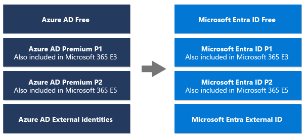
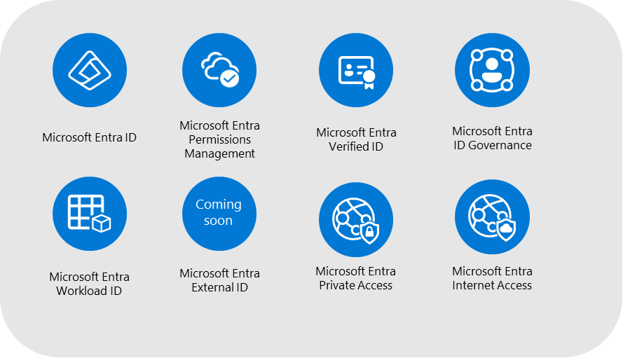

# Microsoft Entra

Microsoft has announced that it will be renaming Azure Active Directory (Azure AD) to **Microsoft Entra ID** as part of its commitment to simplify secure access experiences for everyone.

The renaming will take effect on October 1, 2023, and all existing deployments, configurations, and integrations will continue to function as they do today without any action from users.

[Slides](./Microsoft%20Entra%202023-09-18.pdf)

About me:

 - **Name**: Glen Souza
  - **Title**: Principal Cloud Solution Architect
  - **Company**: Microsoft
  - **LinkedIn**: <https://www.linkedin.com/in/glensouza>
  - **GitHub**: @glensouza <https://github.com/glensouza>

## Agenda

- [What is Microsoft Entra](#what-is-microsoft-entra)
- [Azure AD to Microsoft Entra ID](#azure-ad-to-microsoft-entra-id)
- [License renames](#license-renames)
- [Azure AD feature renames](#azure-ad-feature-renames-to-microsoft-entra-id)
- [What names aren't changing](#what-names-arent-changing)

## What is Identity and Access Management (IAM)

In the context of cloud computing, IAM assumes an even more critical role.

As resources are accessed remotely, often beyond the traditional network boundaries, IAM ensures that only authenticated and authorized users can access these resources.

This enhances security and facilitates regulatory compliance and efficient resource management.

## What is Microsoft Entra

Microsoft Entra ID is Microsoft's cloud-based identity and access management service. It helps organizations securely manage and provide access to their apps, data, and even hardware resources. Here's a brief overview:

- **Identity Management**: Microsoft Entra ID stores information about users (like usernames and passwords) and determines what those users can access and do.
- **Single Sign-On (SSO)**: Allows users to sign in once and then access multiple apps without needing to log in again for each one.
- **Multi-Factor Authentication (MFA)**: Microsoft Entra ID can add an extra layer of security by requiring two or more methods of verification before granting access. For example, besides a password, a user might also need to enter a code sent to their phone.
- **Conditional Access**: It can determine access based on various conditions, such as the user's location, device, or risk level.
- **Integration with Various Apps**: Microsoft Entra ID works not only with Microsoft applications but also with a wide range of external apps, allowing for centralized identity management regardless of the application platform.
Device Management: Microsoft Entra ID can manage devices, ensuring they meet specific security standards before accessing certain resources.

## Azure AD to Microsoft Entra ID

Microsoft Entra is the new name for Azure Active Directory. The name change will be reflected across the service, including the Azure portal, PowerShell, CLI, and APIs.

Personally, I always thought the naming didn't reflect its purpose. Azure AD was not just an on-premise Active Directory version in the cloud. It's a cloud-based identity and access management service.

So now we can think of Microsoft Entra as that **entry** way into all of our services like single sign-on and other centralized security services.

### Why is the name being changed

As part of our ongoing commitment to simplify secure access experiences for everyone, the renaming of Azure AD to Microsoft Entra ID is designed to make it easier to use and navigate the unified and expanded Microsoft Entra product family.

The Microsoft Entra ID name more accurately represents the multicloud and multiplatform functionality of the product, alleviates confusion with the on-premises identity solution (Active Directory), and creates a path to deliver a simpler way to protect every identity and secure every access point as we expand the Microsoft Entra identity and network access portfolio.

### Logo/icon change

Azure AD product icons are replaced with the Microsoft Entra ID product icon.

| Azure AD product icons | Microsoft Entra ID product icon |
| --- | --- |
|   |  |

## Overview of Microsoft Entra ID licenses

### License renames

The new names of standalone offers will be **Microsoft Entra ID Free**, **Microsoft Entra ID P1**, and **Microsoft Entra ID P2**.

### Features and benefits of each license type

Microsoft Entra ID provides multiple licensing tiers, each designed to offer a specific set of features and capabilities:

#### Microsoft Entra ID Free

This is the default version that comes with any Microsoft Online business service, such as Microsoft 365 or Microsoft Azure. It provides basic features suitable for initial cloud engagements.

- **User and Group Management**: Manage your cloud users and groups.
- **On-Premises Directory Synchronization**: Sync with on-premises directories.
- **Basic Reports**: Access to standard reports.
- **Self-Service Password Change**: Allows cloud users to change their passwords.
- **Single Sign-On (SSO)**: SSO across Azure, Microsoft 365, and many popular SaaS apps.

#### Microsoft Entra ID Premium P1

A more advanced version that offers richer enterprise-level identity management capabilities, including hybrid users’ access to both on-premises and cloud resources.

- All features of Microsoft Entra ID Free: Inherits all the capabilities of the Free version.
- **Hybrid Users Access**: Access to both on-premises and cloud resources.
- **Dynamic Groups**: Advanced administration with dynamic group membership.
- **Self-Service Group Management**: Users can create and manage groups.
- **Microsoft Identity Manager**: Synchronize identities and manage user settings.
- **Cloud Write-Back Capabilities**: Enables self-service password reset for on-premises users.

#### Microsoft Entra ID Premium P2

The most advanced licensing tier, offering all the capabilities of Microsoft Entra ID, including advanced identity protection and identity governance features.

- All features of Microsoft Entra ID Premium P1: Inherits all the capabilities of the P1 version.
- **Microsoft Entra Identity Protection**: Provides risk-based Conditional Access to apps and data.
- **Privileged Identity Management (PIM)**: Discover, restrict, and monitor administrators and their access to resources. Provides just-in-time privileged access.

## Azure AD feature renames to Microsoft Entra ID

Licensing, pricing, and functionality aren't changing. Display names will be updated October 1, 2023. Here are some of the most popular Microsoft Entra naming changes, for full list please refer to [this](https://learn.microsoft.com/en-us/azure/active-directory/fundamentals/new-name#glossary-of-updated-terminology) list.

| Category | Old display name for service plan | New display name for service plan | Second use |
| --- | --- | --- | --- |
| Microsoft Entra product family | Microsoft Azure Active Directory, Azure Active Directory, Azure Active Directory (Azure AD), Azure AD, AAD | Microsoft Entra ID | Microsoft Entra ID is preferred, ID is acceptable in product/UI experiences, ME-ID if abbreviation is necessary |
| | Azure Active Directory External Identities, Azure AD External Identities | Microsoft Entra External ID | External ID |
| | Azure Active Directory Identity Governance, Azure AD Identity Governance, Microsoft Entra Identity Governance | Microsoft Entra ID Governance | ID Governance |
| | Azure Active Directory Identity Governance, Azure AD Identity Governance, Microsoft Entra Identity Governance | Microsoft Entra ID Governance | ID Governance |
| |Azure Active Directory Domain Services, Azure AD Domain Services | Microsoft Entra Domain Services | Domain Services |
| Features and functionality | Azure AD account, Azure Active Directory account | Microsoft Entra account - This terminology is only used with IT admins and developers | End users authenticate with a work or school account |
| | Azure AD activity logs | Microsoft Entra activity logs | |
| | Azure AD admin, Azure Active Directory admin |  Microsoft Entra admin | |
| | Azure AD admin center, Azure Active Directory admin center (_Deprecated_) | Replace with Microsoft Entra admin center and update link to entra.microsoft.com | |
| | Azure AD application proxy, Azure Active Directory application proxy | Microsoft Entra application proxy | |
| | Azure AD B2B, Azure Active Directory B2B | Microsoft Entra B2B | |
| | Azure AD built-in roles, Azure Active Directory built-in roles | Microsoft Entra built-in roles | |
| | Azure AD Conditional Access, Azure Active Directory Conditional Access | Microsoft Entra Conditional Access | Conditional Access |
| Acronym usage | AAD | ME-ID _Note:_ that this isn't an official abbreviation for the product but may be used in code or when absolute shortest form is required | |

## What names aren't changing

The following table lists terminology that is not impacted by the Azure AD rename. Names aren't changing for Active Directory, developer tools, Azure AD B2C, nor deprecated or retired functionality, features, or services.

### Active Directory

Windows Server Active Directory, commonly known as Active Directory, and related features and services associated with Active Directory aren't branded with Microsoft Entra.

- Windows Server Active Directory
- Active Directory Federation Services (AD FS)
- Active Directory Domain Services (AD DS)
- Active Directory
- Any Active Directory feature(s)

### Authentication library

- **Azure Active Directory Authentication Library (ADAL)** is deprecated. While existing apps that use ADAL continue to work, Microsoft will no longer release security fixes on ADAL. Migrate applications to the _Microsoft Authentication Library (MSAL)_ to avoid putting your app's security at risk.
- [**Microsoft Authentication Library (MSAL)**](https://learn.microsoft.com/en-us/azure/active-directory/develop/msal-overview) - Provides security tokens from the Microsoft identity platform to authenticate users and access secured web APIs to provide secure access to Microsoft Graph, other Microsoft APIs, third-party web APIs, or your own web API.

### Azure AD B2C

[Azure Active Directory B2C](https://learn.microsoft.com/en-us/azure/active-directory-b2c) isn't being renamed. We're continuing to invest in security, availability, and reliability in Azure AD B2C and our next-generation solution for external identities, [Microsoft Entra External ID](https://learn.microsoft.com/en-us/azure/active-directory/external-identities).

### Graph

- **Azure Active Directory (Azure AD) Graph** is deprecated. Going forward, further investment in Azure AD Graph won't be made, and Azure AD Graph APIs have no SLA or maintenance commitment beyond security-related fixes. Investments in new features and functionalities will only be made in _Microsoft Graph_.
- [Microsoft Graph](https://learn.microsoft.com/en-us/graph) - Grants programmatic access to organization, user, and application data stored in Microsoft Entra ID.

### PowerShell

- **Azure AD PowerShell** for Graph is planned for deprecation on March 30, 2024. For more info on the deprecation plans, see the deprecation update. We encourage you to migrate to _Microsoft Graph PowerShell_, which is the recommended module for interacting with Azure AD.
- [Microsoft Graph PowerShell](https://learn.microsoft.com/en-us/powershell/microsoftgraph/overview) - Acts as an API wrapper for the Microsoft Graph APIs and helps administer every Microsoft Entra ID feature that has an API in Microsoft Graph.

### Accounts

- Microsoft account
- Work or school account

For end user sign-ins and account experiences, follow guidance for work and school accounts in [Sign in with Microsoft branding guidelines](https://learn.microsoft.com/en-us/azure/active-directory/develop/howto-add-branding-in-apps).

### Microsoft identity platform

The Microsoft identity platform encompasses all our identity and access developer assets. It continues to provide the resources to help you build applications that your users and customers can sign in to using their Microsoft identities or social accounts.

### Sync

DirSync and Azure AD Sync aren't supported and no longer work. If you're still using DirSync or Azure AD Sync, you must upgrade to [Microsoft Entra Connect](https://learn.microsoft.com/en-us/azure/active-directory/hybrid/connect/how-to-dirsync-upgrade-get-started) to resume your sync process.

## Resources

If you're interested in learning more, here are some links that will help you learn more about the topics covered here:

- [What is Microsoft Entra](#what-is-microsoft-entra)
- [Azure AD to Microsoft Entra ID](#azure-ad-to-microsoft-entra-id)
- [License renames](#license-renames)
- [Azure AD feature renames](#azure-ad-feature-renames-to-microsoft-entra-id)
- [What names aren't changing](#what-names-arent-changing)

### Learn more about Microsoft Entra

- [What is Azure Active Directory?](https://learn.microsoft.com/en-us/azure/active-directory/fundamentals/whatis)
- [Pricing and free trials](https://aka.ms/PricingEntra)
- [Microsoft Entra ID icon](https://learn.microsoft.com/en-us/azure/active-directory/architecture/architecture-icons)

### Azure AD renamed to Microsoft Entra

- [Official announcement blog](https://www.microsoft.com/en-us/security/blog/2023/07/11/microsoft-entra-expands-into-security-service-edge-and-azure-ad-becomes-microsoft-entra-id)
- [Azure AD is being renamed to Microsoft Entra ID](https://devblogs.microsoft.com/identity/aad-rebrand/)
- [New name for Azure Active Directory - Microsoft Entra](https://learn.microsoft.com/en-us/azure/active-directory/fundamentals/new-name)
- [Microsoft is Renaming Azure AD to Entra ID - Thurrott.com](https://www.thurrott.com/cloud/285529/microsoft-is-renaming-azure-ad-to-entra-id)
- [Microsoft whips up unrest after revealing Azure AD name change](https://www.theregister.com/2023/07/12/azure_ad_name_change)
